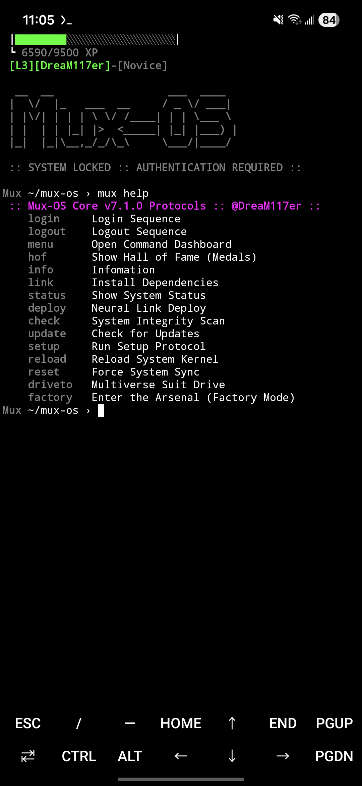
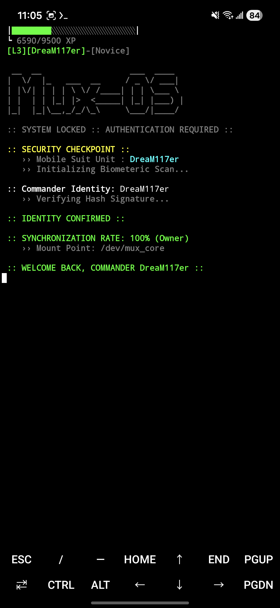
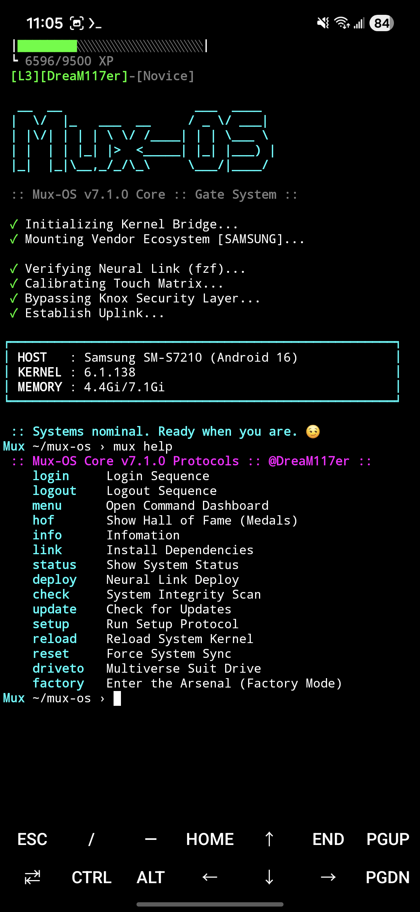
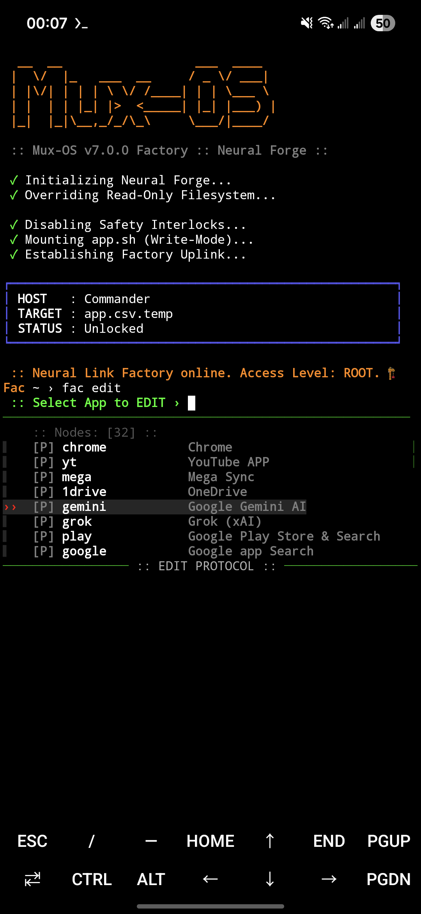

<table>
  <tr>
    <td width="50%">
      
    </td>
    <td width="50%">
      
    </td>
  </tr>
  <tr>
    <td width="50%">
      
    </td>
    <td width="50%">
      
    </td>
  </tr>
</table>

<br>


> *The Android Neural Link / A Personal Cyberdeck Environment*
> *"Logic in mind, Hardware in hand."*

```bash

  __  __                  ___  ____  
 |  \/  |_   ___  __     / _ \/ ___| 
 | |\/| | | | \ \/ /____| | | \___ \ 
 | |  | | |_| |>  <_____| |_| |___) |
 |_|  |_|\__,_/_/\_\     \___/|____/ 

 :: Target: Android/Termux :: v7.0.0 Dual Core ::
 :: Architect: @DreaM117er :: 

    ›› INITIATING MUX-OS KERNEL...
    ›› LOADING MODULES:
    ›› [LOADED] #ai-agent
    ›› [LOADED] #embodied-ai
    ›› [LOADED] #cellphone-control
    ›› [LOADED] #tool-use
    ›› [LOADED] #deterministic-execution
    ›› [LOADED] #human-in-the-loop
    ›› [LOADED] #symbol-grounding
    ›› [LOADED] #gemini-codified
    ›› [LOADED] #termux-automation
    ›› ...
    ›› SYSTEM READY. WAITING FOR ARCHITECT COMMAND.


 :: 01. System Manifest (Mission Briefing) ::
    ›› 這不僅僅是一個 Shell 腳本，這是一個架構在 Android 核心之上的「作業系統」。
    ›› Commander (指揮官)：你是機體的靈魂。
    ›› Mobile Suit (機體)：Mux-OS 是你的外骨骼，Termux 是你的動力爐。
    ›› Neural Link (神經連結)：透過自定義的指令集，將你的意圖轉化為系統的物理動作。
    ›› Hangar (格納庫)：停放著屬於不同指揮官的機體 (Branch)，隨時準備換乘。


 :: 02. Core Architecture (State Machine) ::
    # v7.0.0 引入了絕對的「物理狀態機」，確保系統邏輯的穩定性。

    [STATE: DEFAULT] :: The Hangar (灰色介面)
    ›› 狀態：指揮官位於機體外部 (停機坪)。
    ›› 權限：火控系統鎖定 (Fire Control Locked)。無法執行 App 相關指令。
    ›› 功能：允許執行系統維護、機體換乘 (Drive)、進入兵工廠 (Factory)。

    [STATE: LOGIN]   :: The Cockpit (彩色介面)
    ›› 狀態：指揮官已登入，神經連結同步率 100%。
    ›› 權限：火控系統解鎖 (Weapons Free)。所有自定義指令 (Neural Nodes) 上線。
    ›› 功能：執行日常任務、應用程式呼叫、網路作戰。

    [STATE: FACTORY] :: The Forge (橘色介面)
    ›› 狀態：系統底層寫入模式。
    ›› 權限：ROOT 級別邏輯修改。
    ›› 功能：創造、修改、刪除神經節點 (指令)。


 :: 03. Deployment (Injection) ::
    ›› 將 Mux-OS 核心注入你的終端機。

# ----------------------------------------
# 準備基礎環境
pkg install git ; pkg upgrade
cd ~

# 下載機體藍圖
git clone https://github.com/DreaM117er/mux-os.git

# 進入格納庫並執行初始化
cd mux-os
bash setup.sh
# ----------------------------------------


 :: 04. Tactical Command List ::
    # 核心操作指令 (Core Commands)

    [Session Control]
    ›› mux login    : 身份驗證，進入駕駛艙 (Unlock Fire Control)。
    ›› mux logout   : 斷開連結，返回停機坪 (System Cooldown)。
    ›› mux reload   : 重載系統內核 (Kernel Reload)。
    ›› mux reset    : 強制重置時間線 (Git Reset Hard)，修復一切異常。

    [Hangar Operations]
    ›› mux driveto  : [Drive System] 啓動機體換乘系統，切換至其他分支 (Branch)。
    ›› mux factory  : [Neural Forge] 進入兵工廠，修改系統邏輯。
    
    [System Info]
    ›› mux status   : 顯示當前機體狀態與版本。
    ›› mux info     : 顯示詳細系統清單。
    ›› mux help     : 動態列出所有可用指令。

    [Communication]
    ›› mux          : 喚醒語音系統 (隨機觸發 Bot 回報或指揮官自語)。


 :: 05. The Neural Forge (Factory Mode) ::
    # v7.0.0 最大的變革：你不再需要手寫代碼。
    # "Factory" 是一個內建的 IDE，允許你在終端機內直接鍛造新的指令。

    1. 進入工廠：
       在停機坪 (DEFAULT) 輸入`mux factory`。

    2. 創造指令 (Forging)：
       輸入 `fac new`，系統會引導你設定：
       - Command Name (指令名)
       - Package Name (App 包名，支援 `apklist` 查詢)
       - Parameters (啟動參數)

    3. 測試與部署 (Test & Deploy)：
       - `fac test [cmd]`: 在沙盒環境下測試指令是否正常。
       - `fac deploy`: 將修改永久寫入核心 (`app.csv`) 並覆蓋生產環境。

    # 警告：Factory 模式下的修改是物理級別的寫入。請謹慎操作。


 :: 06. Hangar & Drive System ::
    # 這裡沒有平行宇宙，只有一個巨大的格納庫。
    # 每一位指揮官的配置 (Fork/Branch) 都是一台獨立的機體。

    ›› 執行 `mux driveto` (或 `drive2`)。
    ›› 掃描格納庫 (GitHub Branches)。
    ›› 選擇你要駕駛的機體 (Unit)。
    ›› 系統自動執行 `git checkout` 並重載核心，讓你瞬間獲得該機體的能力。
    
    # Note: 換乘機體前，必須先執行 `mux logout` 離開當前駕駛艙。


 :: 07. Architect's Log ::
    ›› "定義狀態，設置旗標，建立標準 SOP。"
    # 這是 Mux-OS v7.0.0 的核心哲學。我們不再讓代碼隨意遊走，而是將其關進了狀態機的籠子裡。
    
    ›› "防火牆 (Firewall) 不是為了防禦駭客，是為了防禦熵 (Entropy)。"
    # 透過 `exec bash` 的進程置換技術，我們確保了每次狀態切換都是絕對純淨的。
    
    ›› "Logic in mind, Hardware in hand."
    # 這是我的世界，我的規則。
    
    ›› "End of Line, Commander."


 :: 08. Credits ::
    ›› 邏輯架構： @DreaM117er (The Architect)
    ›› 核心演算： Gemini 2.0 Flash (Core Logic & State Machine)
    ›› 創意協作： Grok (Flavor Text & Easter Eggs)