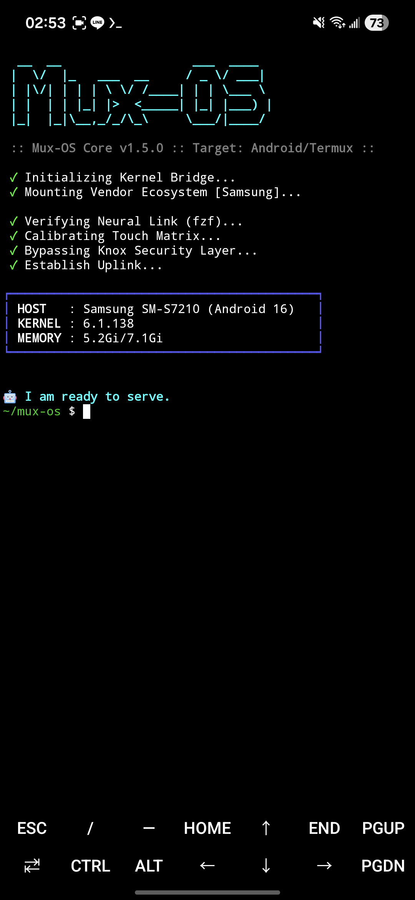
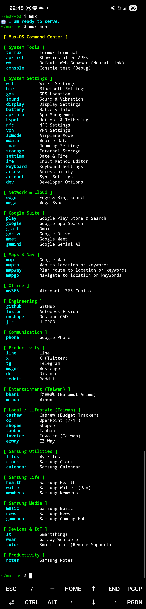
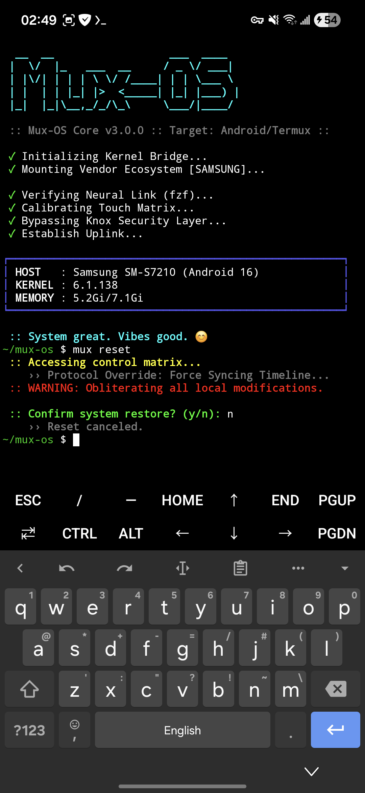

# Mux-OS
> *The Android Neural Link / A Personal Cyberdeck Environment*

<p align="left">
  
</p>


## 設計哲學 (Philosophy)

Termux 是一套類似 Linux 的終端機，但礙於 Android 核心限制，它只有「沙盒（Sandbox）」的功能。我們被強制鎖在這個小空間中，雖然安全，但總覺得少了點什麼。

**Mux-OS 是什麼？**

它是一套建立在 Android 核心周圍運轉的 **「指令模擬呼叫器 (Command Simulator)」**。
它以直覺、人性化、簡化的指令，達到「無縫接軌」的效率。它會讓你產生一種錯覺：「我彷彿真的在手機裡操作一套完整的 Linux OS」。

### 核心亮點
* **No Root Required**: 不需要刷機，只要有 Termux，就能像傻瓜一樣使用。
* **Intuitive**: 指令直覺化（例如 `wb` 上網, `music` 聽歌）。
* **Self-Healing**: 內建自我修復機制，系統衝突一鍵重置。

## 開發者筆記 (Developer's Note)

> "我的腦袋思維模式跟一般人不太一樣..."

Mux-OS 的誕生，源於我與 AI (Gemini) 的一場關於 Termux 的辯論。我從中提煉出了 5 個邏輯點，構成了這套系統的骨架：

1.  **Termux 是個沙盒** -> 但我們可以裝飾這個籠子。
2.  **函數可以代替指令** -> 因爲 Linux 就是這個原則。
3.  **指令要夠直覺** -> 能夠盲打的指令，才是好指令。
4.  **善用 Android 原生 APP** -> 既然手機裡都有裝，何不直接呼叫它們？
5.  **GitHub 是最佳的更新源** -> 讓腳本具備雲端同步能力。

這造就了 Mux-OS 的六大特性：
* **直覺化**：輸入 `google termux`，直接喚醒瀏覽器搜尋。
* **自動化**：不只是執行，還包含錯誤偵測。
* **傻瓜化**：只做「安裝」、「執行」、「使用」、「自定義」。
* **永續性**：不依賴特定手機型號，換手機也能用。
* **擴充性**：`plugins` (廠牌適配) + `app` (個人化) 分層架構。
* **自我修復**：Git 衝突？版本錯誤？一個 `mux reset` 指令全部搞定。

## 操作界面 (Interface)

**系統啟動與狀態檢查**
<p align="left">
  
</p>

**自我修復機制 (Self-Healing in Action)**
<p align="left">
  
</p>

## 安裝教學 (Installation)

只需要一行指令，Mux-OS 就會自動偵測你的裝置品牌 (Samsung/Xiaomi/Asus...) 並完成配置。

### 1. 前置需求
請確保你使用的是 **GitHub 版本** 或  **F-Droid 版本** 的 Termux (Google Play 版本已停止維護)。

### 2. 下載、安裝及部署
在 Termux 中輸入以下指令：

```bash
pkg update && pkg upgrade pkg && install git -y
cd ~
git clone https://github.com/DreaM117er/mux-os.git
cd mux-os
bash setup.sh
```
*(第一次執行core會將需要的功能安裝起來，請直接下指令即可)*

## 使用指南 (Usage)

### Mux-OS 的核心指令是 mux。

- `mux menu`: 叫出圖形化指令儀表板 (Dashboard)。
- `mux update`: 檢查並更新系統。
- `mux reset`: [危險] 強制重置系統至原廠設定（修復所有錯誤）。

### 常用快捷鍵 (Examples)

- `wb` : 開啟瀏覽器 (Neural Link)。
- `wb <內容> `: 預設 瀏覽器啓動 + 搜尋。
- `wifi` : 開啟 Wi-Fi 設定。
- `apklist` : 列出手機內所有 App 的 Package Name。

### 自定義（Customization）

- `app.sh`: 在這裡新增你自己的 App 快捷鍵。
- `plugins/<手機廠牌>.sh`: 跟隨手機廠牌邏輯。
- `system.sh`: 系統底層邏輯（不建議隨意更動）。

*Mux-OS 的強大在於它的可塑性，可以按照下列的模板直接修改再貼入 app.sh 裡面。*

```bash
# === 綠色功能大標題 ===

# : APP功能註解
function custom_command() {
    _require_no_args "$@" || return 1
    _launch_android_app "custom_app_name" "可藉由apklist指令獲得（Name）" "可藉由apklist指令獲得（Activity）"
}
```

## 擴充支援 (Contributing / Plugins)

> **"We need your hardware data." Mux-OS 目前原生支援 Samsung 裝置。**
> **為了讓神經連結擴展到更多硬體（Pixel, Xiaomi, Sony, Oppo...），我們需要你的協助。**

如果你手邊有其他品牌的裝置，請協助我們建立對應的 `Plugin`！

### 如何貢獻 (How to Contribute)

1. 獵取數據 (Hunt Data): 使用 Mux-OS 內建指令 `apklist` 來查詢你手機內建 App 的 Package Name。 (例如：Sony 的相簿可能叫 com.sonymobile.album)

2. 建立檔案 (Create Plugin): 在 `plugins` 資料夾中，建立一個以你的品牌命名的檔案（小寫），例如 `pixel.sh` 或 `sony.sh`。

3. 填入代碼 (Code): 複製以下模板，並填入你查詢到的 Package Name：

```bash
# your_brand.sh 什麼品牌手機全家桶

# === 綠色功能大標題 ===

# : APP功能註解
function custom_command() {
    _require_no_args "$@" || return 1
    _launch_android_app "custom_app_name" "可藉由apklist指令獲得（Name）" "可藉由apklist指令獲得（Activity）"
}
```

4. 提交請求 (Submit PR): 將檔案 Push 上來並發送 Pull Request。一旦核准，你的代碼將成為 Mux-OS 生態系的一部分。


## 致謝 (Credits)
- Core Logic: DreaM117er。
- Co-Pilot / Architect: Google Gemini
- Platform: Termux Team